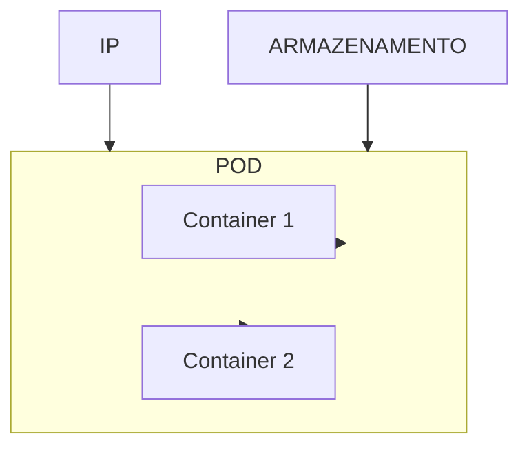
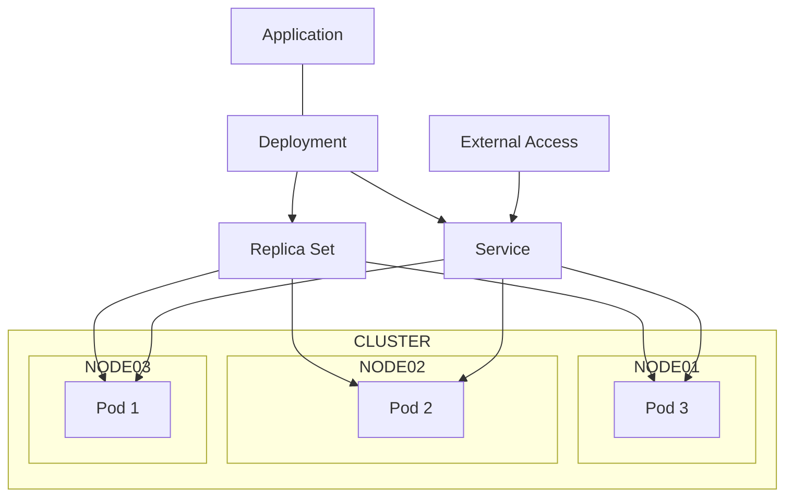

# Introducao a pods, replica sets, deployments e services

## O que são os pods?

Os pods são a menor unidade de implantação do Kubernetes. Eles representam um ou mais contêineres que compartilham o mesmo ambiente de execução, incluindo rede e armazenamento. Os pods são usados para executar as cargas de trabalho do cluster e podem ser criados, escalados e gerenciados usando o Kubernetes.

## O que são os replica sets?

Os replica sets são um recurso do Kubernetes que garante que um número específico de réplicas de um pod esteja sempre em execução. Eles monitoram o estado dos pods e, se um pod falhar ou for excluído, o replica set criará automaticamente um novo pod para substituí-lo. Os replica sets são usados para garantir a alta disponibilidade das cargas de trabalho do cluster.

## O que são os deployments?

Os deployments são um recurso do Kubernetes que gerencia a implantação e a atualização de aplicativos. Eles permitem que você defina o estado desejado para seus aplicativos, incluindo o número de réplicas, a imagem do contêiner e as políticas de atualização. O deployment garante que o estado desejado seja mantido, criando ou excluindo pods conforme necessário. Os deployments também permitem que você faça atualizações de forma controlada, garantindo que as novas versões do aplicativo sejam implantadas sem interrupção.

## O que são os services?

Os services são um recurso do Kubernetes que fornece uma maneira de expor os pods para o tráfego de rede. Eles permitem que você defina um conjunto de pods como um serviço e fornecem um endereço IP estável e um nome DNS para acessar esses pods. Os services também podem ser configurados para balancear a carga entre os pods, garantindo que o tráfego seja distribuído de forma eficiente.

Existem em inumeros tipos:

- ClusterIP: O serviço é exposto apenas dentro do cluster e não é acessível externamente.
- NodePort: O serviço é exposto em uma porta específica em cada nó do cluster, permitindo o acesso externo.
- LoadBalancer: O serviço é exposto por meio de um balanceador de carga externo, que distribui o tráfego para os pods.
- ExternalName: O serviço é mapeado para um nome DNS externo, permitindo o acesso a serviços fora do cluster.
- Headless: O serviço não tem um endereço IP, e os pods são acessados diretamente por meio de seus endereços IP individuais.
- ExternalIPs: O serviço é exposto por meio de um endereço IP externo, que é roteado para os pods.
- Ingress: O serviço é exposto por meio de um controlador de ingresso, que gerencia o tráfego de entrada para os serviços do cluster.
- EndpointSlice: O serviço é exposto por meio de um conjunto de endpoints, que são usados para rotear o tráfego para os pods.
- Service Mesh: O serviço é exposto por meio de uma malha de serviços, que gerencia a comunicação entre os serviços do cluster.
- NetworkPolicy: O serviço é exposto por meio de uma política de rede, que controla o tráfego de entrada e saída para os serviços do cluster.
- ExternalDNS: O serviço é exposto por meio de um serviço de DNS externo, que mapeia os serviços do cluster para nomes DNS externos.
- ServiceAccount: O serviço é exposto por meio de uma conta de serviço, que é usada para autenticar e autorizar o acesso aos serviços do cluster.
- ServiceMonitor: O serviço é exposto por meio de um monitor de serviço, que é usado para coletar métricas e monitorar o desempenho dos serviços do cluster.

## Infraestrutura com 3 nodes

## Autor: **Rafael Friederick**

## Referências

- [Kubernetes Pods](https://kubernetes.io/docs/concepts/workloads/pods/)
- [Kubernetes Replica Sets](https://kubernetes.io/docs/concepts/workloads/controllers/replicaset/)
- [Kubernetes Deployments](https://kubernetes.io/docs/concepts/workloads/controllers/deployment/)
- [Kubernetes Services](https://kubernetes.io/docs/concepts/services-networking/service/)
- [Linux Tips: Pods, Replica Sets, Deployments e Services](https://school.linuxtips.io/path-player?courseid=kubernetes-essentials&pathid=intro-components&playerid=video-1)
